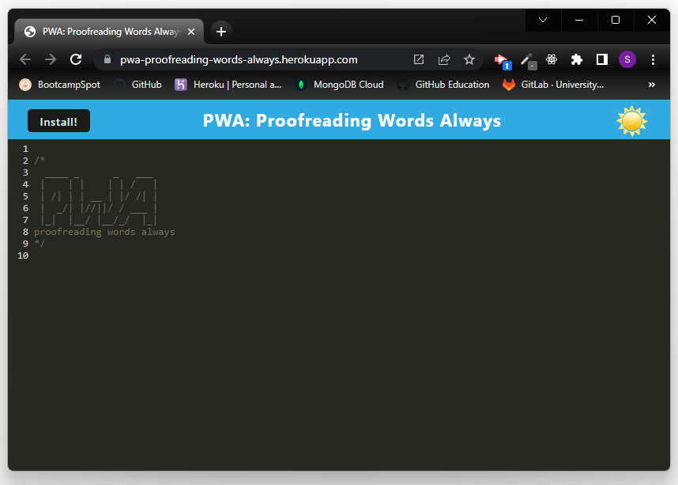
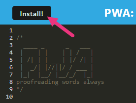
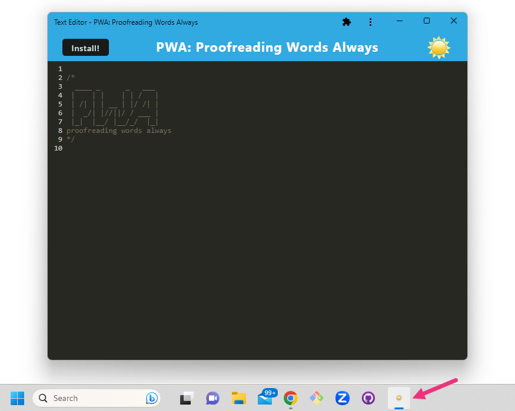
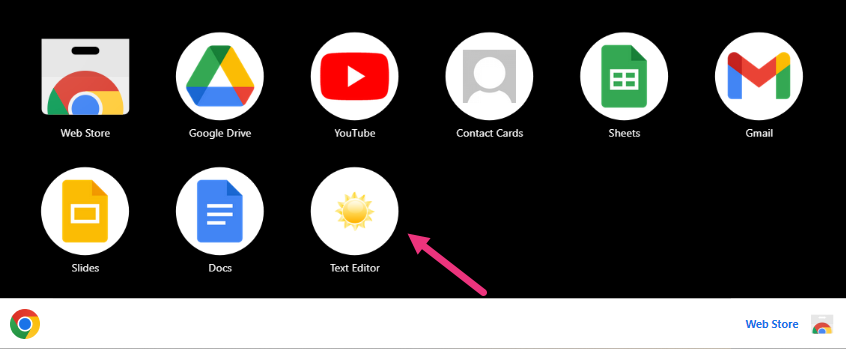

# PWA: Proofreading Words Always
A PWA single-page text editor application that runs in the browser and functions offline.
🖋️✏️

 

## Description
<i>PWA: Proofreading Words Always</i> is a single-page text editor application that operates in both a web browser (online) or a locally installed application (offline).

## Table of Contents

- [Installation](#installation)
- [Usage](#usage)
- [Technology Stack](#technology-stack)
- [Credits](#credits)
- [License](#license)
- [Contact](#contact)

## Installation

This is deployed as a live webpage through Heroku and can be accessed here: [PWA: Proofreading Words Always](https://pwa-proofreading-words-always.herokuapp.com/)

To install the offline Chrome application, please visit the website above and click "Install!" Additional detail with screenshots are provided in the Usage section.

If you are interested in replicating this project into your local repo, please follow these command line steps to build and run the application:

1. Clone the GitHub repository to your local environment using the provided SSH key.

        git clone git@github.com:SunnyOhK/PWA-proofreading-words-always.git

2. From your command line:
    - Insure that all node packages have been installed at the root folder

          /PWA-proofreading-words-always
              npm i
    - To build the application and start the server, there are several paths you may take:
    
          /PWA-proofreading-words-always
                CLI input:             What it does:
              ‾‾‾‾‾‾‾‾‾‾‾‾‾‾‾‾‾‾‾‾‾‾‾‾‾‾‾‾‾‾‾‾‾‾‾‾‾‾‾‾‾‾‾‾‾‾‾‾‾‾‾‾‾‾‾‾‾‾‾‾‾‾‾‾‾‾‾‾‾‾‾‾‾‾‾‾‾‾‾‾
              npm run start:dev ➟ concurrently \"cd server && npm run server\" \"cd client && npm start\"
              npm run start ➟ npm run build && cd server && node server.js
              npm run server ➟ cd server nodemon server.js --ignore client
              npm run build ➟ cd client && npm run build
              npm run install ➟ cd server && npm i && cd ../client && npm i
              npm run client ➟ cd client && npm run dev

            
    - You can then access the page from the [Local Host](http://localhost:3000/)

## Usage 

This application can be viewed from the online Heroku-hosted webpage ( [PWA: Proofreading Words Always](https://pwa-proofreading-words-always.herokuapp.com/) ) and then installed as offline application to be used when not connected to the internet.

### Online | Browser View :

### Click Here to Install Offline Application :

### Offline | Desktop View : 

### Desktop Icon & Chrome Apps View :

## Technology Stack

|  | Tech Stack | Description |
| ---- | --- | --- |
| Foundation |  |  |
|  | JavaScript | Scripting language for webpages |
|  | Node.js | Javascript Framework |
| npm Packages |  |  |
|  | Express | Node.js module |
|  | Babel | JavaScript compiler |
|  | Webpack | JavaScript module bundler |
|  | Nodemon | Utility to monitor code changes and restart server |

NOTE : Additional npm packages and dependencies can be found within the package.json files

## Credits
- Alex Gonzalez: EdX Tutor
- Starter Code was provided for this application.

## License
This project is licensed under: [MIT](https://choosealicense.com/licenses/mit/)
 

## Contact

For questions, please contact me:

### GitHub: 
  &nbsp;&nbsp;&nbsp; [SunnyOhK](https://github.com/SunnyOhK)
### Project Link: 
  &nbsp;&nbsp;&nbsp; https://github.com/SunnyOhK/silly-mongoose
### Email: 
  &nbsp;&nbsp;&nbsp; 127900916+SunnyOhK@users.noreply.github.com
